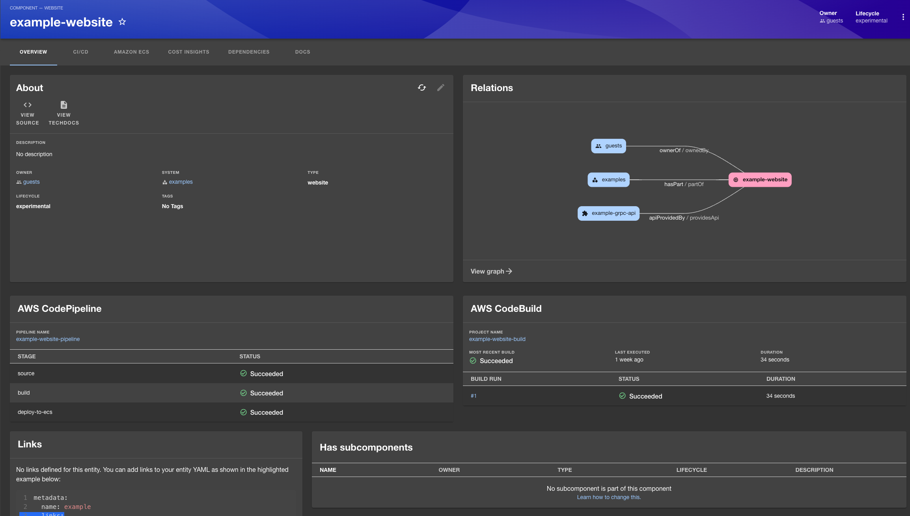

# Tutorial

This document is designed to help you begin testing how the Backstage plugins function in practice.

## Deploy the Sample CDK Project

1. Navigate to the CDK Project Directory

   First, go to the CDK project directory within your repository:

   ```
   cd examples/cdk
   ```

2. Install CDK Project Dependencies

   Inside the cdk directory, install the required dependencies:

   ```
   yarn install
   ```

3. Deploy the CDK Stack

   Deploy the sample AWS resources defined in the CDK stack:

   ```
   cdk deploy
   ```

   This will provision the AWS resources needed for your project. Make sure your AWS credentials are configured properly.

   Note: Deployment may take a few minutes. Once completed, your AWS resources will be ready for use.

## Run backstage APP locally

To run the Backstage app locally, use the following command:

```
yarn dev
```

Then navigate to `http://localhost:3000/catalog/default/component/example-website`. You should see entities displayed as shown below:

